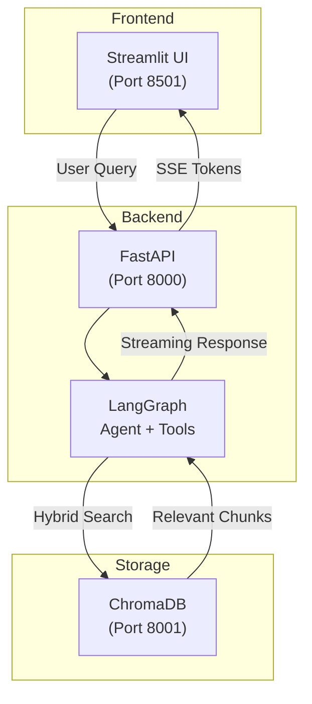

# 🤖 PDF AI Assistant

A document-based AI assistant built with **FastAPI**, **Streamlit**, **LangGraph**, and **ChromaDB**. Upload a PDF and chat with your document using advanced RAG (Retrieval-Augmented Generation).

---

## 🚀 Features

### Core Requirements ✅
| Feature | Implementation |
|---------|----------------|
| **Document Ingestion** | PDF parsing with `pdfplumber`, intelligent chunking |
| **Vector Retrieval** | Gemini embeddings + ChromaDB |
| **Source Citations** | Every answer includes `[DocumentName, Page X]` |
| **Guardrails** | Rejects off-topic questions gracefully |
| **Grounded Responses** | Only answers from document content |

### Bonus Features ✅
| Feature | Implementation |
|---------|----------------|
| **Streaming Responses** | Token-by-token streaming via SSE |
| **Hybrid Search** | BM25 keyword + vector similarity with Reciprocal Rank Fusion |
| **Model Selection** | Choose between ⚡ Fast (8B) or 🧠 Smart (70B) models |
| **"Glass Box" UI** | Real-time thinking process visibility |
| **Starter Questions** | Auto-generated based on document content |
| **Follow-up Suggestions** | 3 contextual questions after each answer |

---

## 🏗️ Architecture



### Key Components

| Component | Technology |
|-----------|------------|
| **LLM** | Groq (`llama-3.1-8b-instant`) |
| **Embeddings** | Google Gemini (`gemini-embedding-001`) |
| **Vector Store** | ChromaDB (Docker) |
| **Agent Framework** | LangGraph with tool calling |
| **Backend** | FastAPI with streaming SSE |
| **Frontend** | Streamlit with custom CSS |

---

## 🛠️ Setup

### Prerequisites
- Docker & Docker Compose
- API Keys: `GROQ_API_KEY`, `GOOGLE_API_KEY`

### Quick Start (Docker)

1. **Configure API Keys**
   ```bash
   cp .env.example .env
   # Edit .env with your API keys
   ```

2. **Run**
   ```bash
   docker compose up --build
   ```

3. **Access**
   - Frontend: [http://localhost:8501](http://localhost:8501)
   - Backend API: [http://localhost:8000/docs](http://localhost:8000/docs)

---

## 📋 API Endpoints

| Endpoint | Method | Description |
|----------|--------|-------------|
| `/ingest` | POST | Upload and process a PDF |
| `/ask` | POST | Send a question (streaming response) |
| `/document-info` | GET | Get current document info + starter questions |
| `/clear-document` | DELETE | Delete current document from vector store |

---

## 🔍 Design Decisions

### Why Hybrid Search?
During testing, we discovered that pure vector search missed variations like "multi agent" vs "multi-agent". We implemented BM25 + vector fusion for robust retrieval.

### Why Groq?
Gemini's free tier has aggressive rate limits. Groq offers a generous free tier with excellent latency and full tool-calling support.

### Why Single-Document Mode?
For simplicity and clarity, each upload replaces the previous document. Multi-document support with source filtering is a planned enhancement.

---

## ⚠️ Known Limitations

### Structured Table Data
Vector embeddings are fundamentally designed for semantic similarity, not exact string matching. When a PDF contains tables with **very similar entries** (e.g., model numbers like "RD EDGEPRO 210E TAI" vs "RD EDGEPRO 210D TAF"), accuracy varies by model size.

**Recommendation:** Use **🧠 Smart (70B)** model for table queries - it handles similar entries much better than the 8B model.

**Works well for:**
- Prose and paragraph text
- Distinct categorical data
- General document Q&A
- Table queries (with 70B model)

**May have accuracy issues with:**
- Tables with nearly-identical row identifiers (on 8B model)
- Spec sheets with incremental model numbers (on 8B model)

**Production solution:** Store tabular data in a structured database (SQLite/PostgreSQL) and use exact-match queries for table lookups.

---

## 🧪 Testing

```bash
# Run backend tests
pytest tests/

# Manual API test (after docker is running)
curl -X POST "http://localhost:8000/ask" \
  -H "Content-Type: application/json" \
  -d '{"question": "Hello", "chat_history": []}'
```

---

## 📝 Future Improvements

### Major Enhancement: LiteLLM Provider Abstraction
Add a **LiteLLM** container to the Docker stack to unify all LLM providers behind a single OpenAI-compatible API. This would:
- Allow switching between 100+ LLM providers (OpenAI, Anthropic, Gemini, Groq, Ollama, etc.)
- Keep the codebase using a single `openai` client
- Enable model selection dropdown in the UI
- Simplify API key management

### Other Improvements
- [ ] OCR for image-based PDF pages (using `doctr` or `pytesseract`)
- [ ] Multi-document support with source filtering
- [ ] Math/calculation tool for complex table operations
- [ ] Observability integration (LangSmith/Langfuse)
- [ ] Chat history export (JSON/Markdown)

---

## 📄 License

MIT
